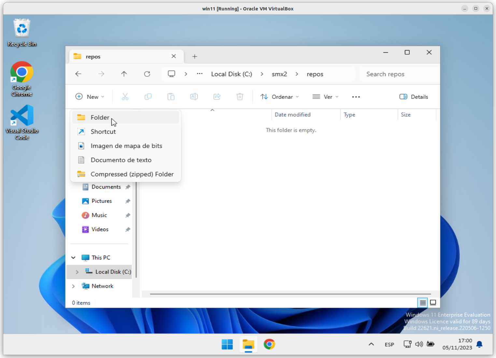
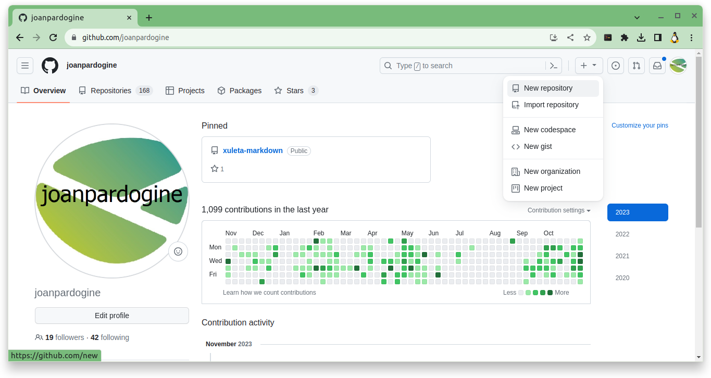
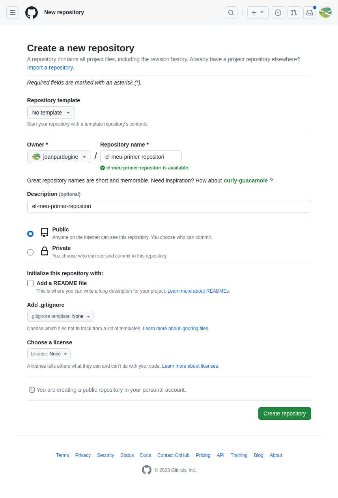

# A01U - Activitat 1 - Primera activitat amb ***```git```***

## ***TRES*** pre-requisits:

***Requisit* 1.** Tenir instal·lat l'**```IDE```** **```Visual Studio Code```**. Un **```IDE```** és un **Entorn integrat de desenvolupament** (de les sigles en anglès: ***Integrated Development Environment***).

> ### Per fer la instal·lació del **```Visual Studio Code```** podeu seguir els [Passos per instal·lar l'**IDE** **```Visual Studio Code```**](./manuals/instalar-vsc.md)

***Requisit* 2.** Tenir instal·lat el **sistema de control de versions** **```git```**. Consisteix en una aplicació que **gestiona de canvis en arxius i directoris**.

> ### Per fer la instal·lació del **sistema de control de versions** **```git```** podeu seguir les [Passos per instal·lar el **sistema de control de versions** **```git```**](./manuals/instalar-git.md)

Aquí teniu un [Git Tutorial (w3schools.com)](https://www.w3schools.com/git/default.asp?remote=github)

***Requisit* 3.** Tenir un compte de [**```github.com```**](https://github.com/), podeu seguir els passos de [**Getting started with your GitHub account**](https://docs.github.com/en/get-started/onboarding/getting-started-with-your-github-account)


***Requisit* 4.** Tenir creat al vostre ordinador l'**estructura inicial**, cal que seguiu els passos de [Passos per crear **l'estructura inicial**](./manuals/crea-creacio-estructura.md) 

> ### Abans de començar cal fer la [Comprovació de que ho teniu ben instal·lat](./manuals/comprovacio-tot-ben-installat.md)

Un cop ja teniu els **dos programes instal·lats**, i el **compte creat** [**```github.com```**](https://github.com/) i **l'estructura inicial** creada, ja podeu començar aquesta activitat.

## Objectiu:

Crear un projecte amb el nom **```el-meu-primer-repositori```**, amb:
* un **repositori local** i
* un **repositori remot**,
* que estiguin **vinculats**.

Fent servir **```git```** com a **sistema de control de versions** i l'**IDE** **```Visual Studio Code```**.

## **Pas 1.** Crear un **repositori local** al vostre ordinador.

> ## NOTA: **Bona pràctica** 
> 
>  Com a **bona pràctica**, us recomano, crear sempre una carpeta pel ***repositori local***, amb el mateix nom que el vostre ***repositori remot***.

Nom de la carpeta per crear el vostre **repositori local**: **```el-meu-primer-repositori```**.

Dins de la carpeta 


## **Pas 2.** Crear un **repositori remot** al vostre compte de [**```github.com```**](https://github.com/).

<!-- <details>
<summary>Desplega per veure l'Índex</summary>

1. [Comanda **```git status```** per veure l'estat del repositori](./README.md#comanda-git-status-per-veure-lestat-del-repositori-1)

1. [Inicialitzar un repositori](./README.md#inicialitzar-un-repositori-1)

1. [Afegir fitxers, i comanda **```commit```**.](./README.md#afegir-fitxers-i-comanda-commit-1)

1. [Setting your commit email address](./README.md#setting-your-commit-email-address-1)

1. [Setting your username in Git](./README.md#setting-your-commit-email-address-1)

1. [Creació d'un usuari a github.com](./README.md#creacic3b3-dun-usuari-a-githubcom-1)

1. [Creació d'un repositori a la vostre compta a github.com](./README.md#creació-dun-repositori-a-la-vostre-compta-a-githubcom-1)

1. [Com convidar a un col·laborador a un repositori a la vostre compta a github.com](./README.md#com-convidar-a-un-collaborador-a-un-repositori-a-la-vostre-compta-a-githubcom-1)

1. [Inviting collaborators to a personal repository](./README.md#inviting-collaborators-to-a-personal-repository)
</details> -->


**1.** Crear la carpeta contenidora del nostre projecte.

El nom del projecte que seguirem durant aquesta activitat és **```el-meu-primer-repositori```**.

Com a bona pràctica, us recomano que el **nom de la carpeta** contenidora del nostre **repositori local**, sigui el mateix nom que el nom del nostre **repositori remot**. 

Per tant, crearem una carpeta que anomenarem **```el-meu-primer-repositori```**, i que serà  la que farem servir per guardar i centralitzar el projecte o repositori **```el-meu-primer-repositori```**.

En el meu cas, la carpeta es troba a dins de la unitat **```D:```** del meu portatil.

Per fer-ho executarem les següents comandes.
```sh
~$ mkdir el-meu-primer-repositori
~$ cd el-meu-primer-repositori
~/el-meu-primer-repositori $ pwd
\d\el-meu-primer-repositori
```

Com veieu des de la shell de linux per accedir a la unitat **```D:```** cal accedir amb **```/d/```**.

# Creació del repositori remote a la web de [github.com](https://github.com/)





Existeix una comanda que ens mostra en quin estat es troba el nostre repositori.

Un cop ja siguem dins de la carpeta que acabem de crear podem provar d'executar la comanda **``git status``** que ens mostrarà quin és l'estat del repositori.

```sh
~/el-meu-primer-repositori $ git status
fatal: not a git repository (or any of the parent directories): .git
~/el-meu-primer-repositori $
```

Obtenim un error, que ens diu que no és un **repositori**. Això  és normal, ja que per defecte, cap carpeta és un **repositori**.

# Inicialitzar un *repositori*

Per fer que la nostra carpeta sigui un **repositori**, és a dir, per dir-li a **```git```** que volem que porti el control dels canvis al fitxers, cal que executem la comanda **```git init```**.

**Comanda**:

```sh
git status
```

**Exemple**:

```sh
~/el-meu-primer-repositori $ git init
Initialised empty Git repository in /d/el-meu-primer-repositori/.git/
~/el-meu-primer-repositori $ 
```

Ens mostra el missatge (**```Initialised empty Git repository in /d/el-meu-primer-repositori/.git/```**), és a dir, que s'ha inicialitzat com a **repositori buit** la ruta (**``/d/el-meu-primer-repositori/.git/``**).`

> ## **NOTA IMPORTANT**
> ### Tingueu present que si a un **repositori** que ja teniu creat, torneu a executar la comanda **```git init```**, eliminarà tota la informació dels canvis que ha registrat fins al moment i crearà, com ja s'ha comentat, un **repositori buit**.
> <br>
<br>

Tanmateix, si mirem el contingut de la carpeta **```el-meu-primer-repositori```** amb un **```ls -l```** o amb un **```dir```**, veiem que, aparentment no hi ha res creat.

**Comanda**:

```sh
ls -l
```

**Exemple**:

```sh
~/el-meu-primer-repositori $ ls -l
total 0
~/el-meu-primer-repositori $
```

Però si executem la comanda perquè mostri els fitxers ocults **```ls -la```** o **```dir /a```**, llavors sí que veiem que hi ha una carpeta nova anomenada **```.git```**, el que passa és que és oculta.

**Comanda**:

```sh
ls -la
```

**Exemple**:

```sh
~/el-meu-primer-repositori $ ls -a
total 12
drwxrwxr-x 3 user user 4096 Sep 24 13:00 .
drwxrwxrwx 7 user user 4096 Sep 24 13:00 ..
drwxrwxr-x 7 user user 4096 Sep 24 13:00 .git
~/el-meu-primer-repositori $ 
```

Aquesta carpeta **```.git```** és la que conté tota la informació de **```git```** sobre el projecte. Cada vegada que es facin canvis, ja sigui afegint fitxers, modificant el contingut dels fitxers, creant o esborrant subcarpetes ,etc aquests canvis s'aniran guardant en aquesta carpeta. Per tant, **és important** que no l'esborreu, ni li feu res, ja que és **imprescindible** per poder interactuar amb **```git```**.

Si accedim a aquesta carpeta **```.git```** amb un **```cd .git```**, i llistem el contingut amb **```ls -l```** o amb **```dir```** podrem veure tot el contingut que necessita **```git```** per funcionar.

**Comanda**:

```sh
cd .git
```

**Exemple**:

```sh
~/el-meu-primer-repositori $ cd .git
~/el-meu-primer-repositori/.git$ ls -l
total 32
drwxrwxr-x 2 user user 4096 Sep 24 13:00 branches
-rw-rw-r-- 1 user user   92 Sep 24 13:00 config
-rw-rw-r-- 1 user user   73 Sep 24 13:00 description
-rw-rw-r-- 1 user user   23 Sep 24 13:00 HEAD
drwxrwxr-x 2 user user 4096 Sep 24 13:00 hooks
drwxrwxr-x 2 user user 4096 Sep 24 13:00 info
drwxrwxr-x 4 user user 4096 Sep 24 13:00 objects
drwxrwxr-x 4 user user 4096 Sep 24 13:00 refs
~/el-meu-primer-repositori/.git$ 
```

Però, si ara tornem enrere, amb **```cd ..```**, és a dir, a la carpeta **```<CognomAlmune>-primer-repositori```** i executem la comanda **```git -status```**, la resposta rebuda és una altra.

**Comanda**:

```sh
git status
```

**Exemple**:

```sh
~/el-meu-primer-repositori/.git$ cd ..
~/el-meu-primer-repositori $ git status
On branch main

No commits yet

nothing to commit (create/copy files and use "git add" to track)

~/el-meu-primer-repositori $
```

Ens mostra els següents missatges que volen dir:

* **```On branch main```**, que ens trobem a la branca (**```branch```**) principal (**```main```**)
* **```No commits yet```**, que encara no hi ha res per confirmar (**```commit```**) i per últim,
* **```(create/copy files and use "git add" to track)```**, que si volem afegir fitxers perquè comenci a gestionar la traçabilitat d'aquests, cal que fem servir la comanda **```git add```** per afegir els fitxers a la llista dels fitxers que volem afegir al **repositori**.

Per tant, fins ara no hem fet res més que indicar quina és la carpeta del nostre **repositori**. Però ja estem preparats per crear i/o modificar fitxers i dur el control dels canvis que fem sobre aquests.


# Afegir fitxers, i comanda **```commit```**.

Per començar crearem tres fitxers.

1. **```index.html```**,
1. **```main.js```** i
1. **```styles.css```**.


**1.** Fitxer **```index.html```**,

El primer l'anomenem **```index.html```** ([pardo-primer-repositori (codepen.io)](https://codepen.io/joanpardo/pen/QWBzLwp)), i afegim el text bàsic per crear una senzilla pàgina web.

Podeu fer servir el **```Notepad```** de **Windows**. Per fer-ho pressioneu la tecla de <kbd>Windows</kbd> + <kbd>R</kbd> i escriviu **```notepad.exe```**, i això  us obrirà el **```Notepad```**.

Copieu el següent codi:

```html
<html lang="ca">
  <head>
    <meta charset="utf-8">
    <title>Activitat primer repositori</title>
  </head>
  <body>
  
  </body>
</html>
```

I guardeu el fitxer a la vostra ruta:

```sh
el-meu-primer-repositori
```

Un cop que hem creat, modificat i guardat aquest primer fitxer, anem a veure què és el que ens diu **```git```**.

**Comanda**:

```sh
git status
```

**Exemple**:

```sh
~/el-meu-primer-repositori $ git status
On branch main

No commits yet

Untracked files:
  (use "git add <file>..." to include in what will be committed)
        index.html

nothing added to commit but untracked files present (use "git add" to track)
~/el-meu-primer-repositori $ 
```

Ara apareix una secció **```Untracked files```**, és a dir, una apartat a on ens mostra aquells fitxers, que no estan **marcats** per controlar els seus els canvis, és a dir que ***NO* tenen de traça**.

És a dir, que el fitxer **```index.html```**, no està marcat per controlar els canvis que es facin sobre ell.

A part, apareix la següent explicació:
```sh
use "git add ..." to include in what will be committed
```

La comanda **```git add ...```** afegeix un fitxer al **repositori** local i el prepara per a la confirmació. Per eliminar o treure un fitxer, cal fer servir **```git reset HEAD <<nomFitxer>>```**.

És a dir, que cal fer servir **```git add ...```** per incloure els fitxers que volem que **```git```** comenci a controlar.

I per últim ens indica:

```sh
nothing added to commit but untracked files present (use "git add" to track)
```

Que tot i que hi ha **fitxers sense traça** (**```untracked files```**), no hi ha res afegit per **confirmar**, és a dir per incloure en el següent control. I ens indica que cal fer per afegir fitxers al control, "**```(use "git add" to track)```**, és a dir feu servir **```git add```** per afegir fitxers a traçar.

Fixeu-vos que aquests fitxers sense traça, apareixen de color vermell, i en el nostre cas apareix el fitxer **```index.html```** que acabem d'afegir, però com que no l'hem afegit al control de traça, **``git``** encara no el té a la llista de fitxers a controlar.

Ara mateix, per molt que nosaltres el modifiquem el fitxer **```index.html```**, **``git``** mai detectarà els canvis, ni controlarà els canvis que fem sobre aquest fitxer.

## Afegir fitxers

Perquè **```git```** tingui present el fitxer **```index.html```**, cal afegir-lo.

I per això  existeix la comanda **```git add <nomDelFitxer>```**.

**Comanda**:

```sh
git add index.html
```

**Exemple**:

```sh
~/el-meu-primer-repositori $ git add index.html
```

Un cop que hem afegit el fitxer **```index.html```**, anem a veure quin és l'estat del nostre **repositori** amb **```git status```**.

**Comanda**:

```sh
git status
```

**Exemple**:

```sh
~/el-meu-primer-repositori $ git status
On branch main

No commits yet

Changes to be committed:
  (use "git rm --cached <file> ..." to unstage)
        new file:   index.html

~/el-meu-primer-repositori $ 
```

Un cop afegit el fitxer **```index.html```**, si tornem a executar la comanda **```git status```**, ara apareix un nou missatge **```Changes to be committed```** és a dir, canvis per ser controlats. I el fitxer **```index.html```** ja apareix com a fitxer nou i de color verd.

Ara és el moment de fer un **```commit```**. Un **```commit```** o **confirmació** és un **punt de control** en el nostre projecte. 

Acabarem tenint molts **```commit```**'s, cada vegada que fem alguna cosa important o prou rellevant. Com un petit **punt de control** al qual sempre podrem tornar

Per tant, és **molt recomanable** realitzar aquests **```commit```**'s, per exemple cada vegada es crea un nou fitxer, o afegim una única funció de **```javascript```** (per exemple), o hem modificat alguns estils, etc.

És a dir, cal fer un **```commit```** cada vegada que es vulgui crear un **punt de control**, que volem recordar, o al que volem poder tornar més endavant.


Per fer-ho, cal fer servir, la comanda **```git commit```** amb el paràmetre **```-m```**, per afegir-li un **missatge**, comentari o nom que l'identifiqui. I tot i que és possible no afegir cap missatge, és molt recomanable, afegir-ne un que sigui útil i descriptiu sobre el que acabem de fer. Com per exemple, **```Creat el fitxer index.html```**.
Això  ens serà  molt útil per més endavant, per quan veiem el log dels **```commit```**'s, puguem reconèixer a cadascun d'ells i saber que és el que vam fer just en aquell moment.

```sh
~/el-meu-primer-repositori $ git commit -m "Creat el fitxer index.html"
[main (root-commit) 74859bc] Creat el fitxer index.html
1 file changed, 10 insertions(+)
create mode 100644 index.html

~/el-meu-primer-repositori $ 
```

<hr>

<details>
<summary>Si us apareix un error ...</summary>

> <hr>
>
>  Si us apareix un error a l'hora de fer el **```commit```**, reviseu els següents punts:
> 
> [Setting your commit email address](https://docs.github.com/en/account-and-profile/setting-up-and-managing-your-personal-account-on-github/managing-email-preferences/setting-your-commit-email-address)
>
> [Setting your username in Git](https://docs.github.com/en/get-started/getting-started-with-git/setting-your-username-in-git)
> <hr>
</details>

<hr>

Ara afegirem dos fitxers més: **```main.js```** i **```styles.css```**

```sh
~/el-meu-primer-repositori $ touch main.js
~/el-meu-primer-repositori $ touch styles.css
~/el-meu-primer-repositori $ ls -l
-rw-rw-r-- 1 user user 130 Sep 24 13:00 index.html
-rw-rw-r-- 1 user user   0 Sep 24 13:00 main.js
-rw-rw-r-- 1 user user   0 Sep 24 13:00 styles.css

~/el-meu-primer-repositori $ 
```

I de moment els deixem buits i anem a veure què ha passat al git.

```sh
~/el-meu-primer-repositori $ git status
On branch main
Untracked files:
  (use "git add <file>..." to include in what will be committed)
           main.js
           styles.css

nothing added to commit but untracked files present (use "git add" to track)

~/el-meu-primer-repositori $
```

Abans de seguir cal confirmar que tenim la nostra instal·lació de git al nostre ordinador ben configurat.


## [Setting your commit email address](https://docs.github.com/en/account-and-profile/setting-up-and-managing-your-personal-account-on-github/managing-email-preferences/setting-your-commit-email-address)

## [Setting your username in Git](https://docs.github.com/en/get-started/getting-started-with-git/setting-your-username-in-git)

# Creació d'un usuari a [github.com](https://github.com/)

[Signing up for a new GitHub account](https://docs.github.com/en/get-started/signing-up-for-github/signing-up-for-a-new-github-account)


# Creació d'un **repositori** a la vostre compta a [github.com](https://github.com/)

[Create a repo](https://docs.github.com/en/get-started/quickstart/create-a-repo)

# Com convidar a un col·laborador a un repositori a la vostre compta a [github.com](https://github.com/)

[Inviting collaborators to a personal repository](https://docs.github.com/en/account-and-profile/setting-up-and-managing-your-personal-account-on-github/managing-access-to-your-personal-repositories/inviting-collaborators-to-a-personal-repository)

