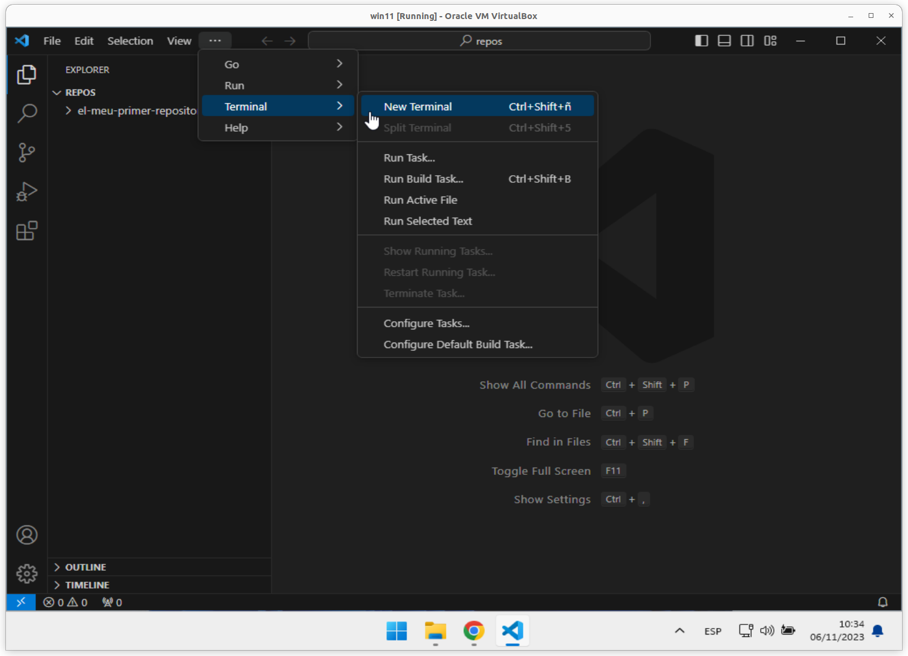
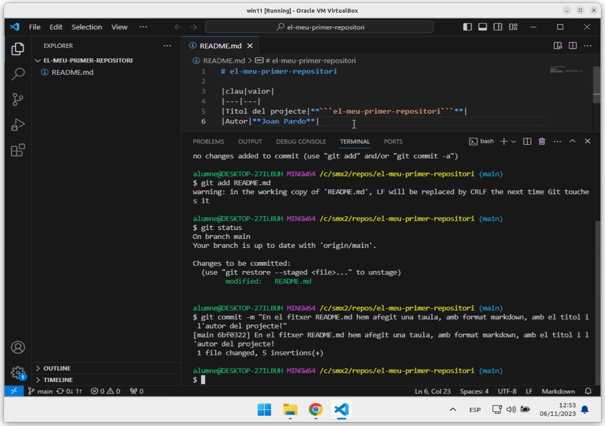

# Primera activitat amb ***```git```***

> ## MP07 UF01 A01U - Activitat 1

<details><summary>Pitja per veure l'índex</summary>

> <hr>
> 
> * [**Pas 1.** Crear un **repositori local** al vostre ordinador.](#pas-1-crear-un-repositori-local-al-vostre-ordinador) 
> 
> * [**Pas 2.** Crear un **repositori remot** al vostre compte de **```github.com```**](#pas-2-crear-un-repositori-remot-al-vostre-compte-de-githubcom)
> 
> * [**Pas 3.** Vincular el vostre **repositori local** amb el vostre **repositori remot** creat al compte de **```github.com```**.](#pas-3-vincular-el-vostre-repositori-local-amb-el-vostre-repositori-remot-creat-al-compte-de-githubcom)
> 
> * [**Pas 4.** Modificar el fitxer **```README.md```**](#pas-4-modificar-el-fitxer-readmemd)
> 
> * [**Pas 5.** Guardar els canvis fets en els fitxers del nostre repositori local](#pas-5-guardar-els-canvis-fets-en-els-fitxers-del-nostre-repositori-local)
> 
> * [**Pas 6.** Afegim els fitxers a la llista de fitxers que cal que controli **```git```**.](#pas-6-afegim-els-fitxers-a-la-llista-de-fitxers-que-cal-que-controli-git)
> 
> * [**Pas 7.** Crear un nou punt de restauració](#pas-7-crear-un-nou-punt-de-restauració)
> 
> * [**Pas 8.** Enviar l'estat del nostre **repositori local** cap al nostre **repositori remot**. ](#pas-8-enviar-lestat-del-nostre-repositori-local-cap-al-nostre-repositori-remot)
> 
> * [**Pas 9.** Actualitzar la pàgina del nostre **repositori remot**.](#pas-9-actualitzar-la-pàgina-del-nostre-repositori-remot)
> 
> <br>
> <hr>

</details>

## ***QUATRE*** pre-requisits:

***Requisit* 1.** Tenir instal·lat l'**```IDE```** **```Visual Studio Code```**. Un **```IDE```** és un **Entorn integrat de desenvolupament** (de les sigles en anglès: ***Integrated Development Environment***).

> ### Per fer la instal·lació del **```Visual Studio Code```** podeu seguir els [Passos per instal·lar l'**IDE** **```Visual Studio Code```**](./manuals/vsc-instalar.md)

***Requisit* 2.** Tenir instal·lat el **sistema de control de versions** **```git```**. Consisteix en una aplicació que **gestiona de canvis en arxius i directoris**.

> ### Per fer la instal·lació del **sistema de control de versions** **```git```** podeu seguir les [Passos per instal·lar el **sistema de control de versions** **```git```**](./manuals/git-instalar-git.md)

Aquí teniu un [Git Tutorial (w3schools.com)](https://www.w3schools.com/git/default.asp?remote=github)

***Requisit* 3.** Tenir un compte de [**```github.com```**](https://github.com/), podeu seguir els passos de [**Getting started with your GitHub account**](https://docs.github.com/en/get-started/onboarding/getting-started-with-your-github-account)


***Requisit* 4.** Tenir creat al vostre ordinador l'**estructura inicial**, cal que seguiu els passos de [Passos per crear **l'estructura inicial**](./manuals/crea-creacio-estructura.md) 

> ### Abans de començar cal fer la [Comprovació de que ho teniu ben instal·lat](./manuals/ctrl-comprovacio-tot-ben-installat.md)

Un cop ja teniu els **dos programes instal·lats**, el **compte creat** [**```github.com```**](https://github.com/) i **l'estructura inicial** creada, ja podeu començar aquesta activitat.

## Objectiu:

Crear un projecte amb el nom **```el-meu-primer-repositori```**, amb:
* un **repositori local** i
* un **repositori remot**,
* que estiguin **vinculats**.

Fent servir **```git```** com a **sistema de control de versions** i l'**IDE** **```Visual Studio Code```**.

## **Pas 1.** Crear un **repositori local** al vostre ordinador.

> ## NOTA: **Bona pràctica** 
> 
>  Com a **bona pràctica**, us recomano, crear sempre una carpeta pel ***repositori local***, amb el mateix nom que el vostre ***repositori remot***.

Nom de la carpeta per crear el vostre **repositori local**: **```el-meu-primer-repositori```**.


Dins de la carpeta **```c:\smx2\repos```**, crearem la carpeta **```el-meu-primer-repositori```**.


Ara obrirem la carpeta **```c:\smx2\repos\el-meu-primer-repositori```** des de el **```Visual Studio Code```**.


Per fer-ho, seleccionada la carpeta **```c:\smx2\repos\el-meu-primer-repositori```**, pitjarem el botó dret del ratolí, i seleccionarem l'opció **```Show more options```**, perquè ens mostri més opcions del menú contextual.


I a continuació seleccionarem l'opció **```Open with Code```**, per que ens obri el **```Visual Studio Code```** situat ja en aquesta carpeta.

La primera vegada que obrim qualsevol carpeta amb **```Visual Studio Code```**, aquest ens pregunta si ***Confiem en els autors dels fitxers d'aquesta carpeta***, li diem que ***sí***, és a dir, pressionem el botó . 


I ja tenim el **```Visual Studio Code```** obert i situat a la carpeta **```c:\smx2\repos\el-meu-primer-repositori```**.


## **Pas 2.** Crear un **repositori remot** al vostre compte de [**```github.com```**](https://github.com/).

Des de el vostre compte de [**```github.com```**](https://github.com/),
desplegant el símbol **```+```**  i escollirem l'opció **New repository**, per crear un nou repositori.


A la finestra **Create a new repository**, en el camp **```Repository name```** escriurem el nom del repositori que volem crear, en el nostre cas, i seguint les bones pràctiques comentades, serà el nom del projecte **```el-meu-primer-repositori```**.


A continuació marquem l'opció **```Private```**. 
> ## NO cal marcar l'opció **```Add a README.md file```**.


I per últim pressionem el botó **```Create repository```**, per crear el nou repositori.

Un cop creat el nou repositori ens apareix el següent:


Si ens desplacem una mica cap avall, veurem un seguit de comandes a la secció amb el titol **```... or create a new repository on the command line```**


Aquestes son les comandes, i cal copiar-les totes per poder-les fer servir a continuació.

```
echo "# el-meu-primer-repositori" >> README.md
git init
git add README.md
git commit -m "first commit"
git branch -M main
git remote add origin https://github.com/<usuariGithub>/el-meu-primer-repositori.git
git push -u origin main
```

> Si no us funciona el botó de copiar, sempre podeu seleccionar les comandes i amb el botó dret del ratolí copiar-les al porta-papers del sistema operatiu.
>
> 

## **Pas 3.** Vincular el vostre **repositori local** amb el vostre **repositori remot** creat al compte de [**```github.com```**](https://github.com/).

Un cop que hem copiat totes aquestes comandes, passarem al **```Visual Studio Code```**.

I com ja s'ha vist anteriorment, obrirem una **finestra de terminal**.



Un cop oberta la **finestra de terminal** podeu enganxar totes les comandes, col·loqueu-vos a sobre de la **finestra de terminal** i  pressionant el botó dret del ratolí se us enganxaran les comandes que heu copiat anteriorment. 


Si a continuació pressioneu la tecla <kbd>Intro</kbd>

<details><summary>Pitja aquí si t'apareix la finestra Connect to GitHub</summary>

> <hr>
> La primera vegada us apareixerà aquesta finestra, per validar l'usuari i la contrasenya.
> 
> 
> 
> Pressioneu el botó **```Sign in with your browser```**, repeteixo que us apareixerà només si és la primera vegada que connecteu **```Visual Studio Code```** a [**```github.com```**](https://github.com/).
> 
> 
> 
> pressionar el botó **```Authorize git-ecosystem```**, per autoritzar la connexió.
> 
> 
> <br>
> <hr>
</details>
<br>

I si apareix la següent pantalla:


I si tornem al nostre **repositori remot** i pressionem per actualitzar la pàgina, aquesta s'actualitza i ens mostra els canvis que hem pujat amb el **```git push```**.


## **Pas 4.** Modificar el fitxer **```README.md```**

Per modificar el fitxer **```README.md```** cal obrir-lo amb el **```Visual Studio Code```**.

Si des del menú lateral de l'esquerra pitgem dues vegades sobre qualsevol fitxer, aquest s'obre automàticament.

I ja podem començar a treballar el contingut del fitxer.


En aquest exemple crearé una llista amb en nom del projecte  **```el-meu-primer-repositori```** i el nom de l'autor del projecte, és a dir, **Joan Pardo**.

Per fer-ho, primer us ensenyo com crear una taula:

```
|clau|valor|
```

Aquesta primera línia serà el contingut de les capçaleres de la taula.

```
|---|---|
```

Aquesta segona línia és per indicar que es tracta d'una taula.

I a continuació, i separat pel caràcter **```|```** cal escriure el contingut de cada fila.

```
|Titol del projecte|**```el-meu-primer-repositori```**|
|Autor|**Joan Pardo**|
```

I si ara ho ajuntem tot quedarà de la següent manera:

```
|clau|valor|
|---|---|
|Titol del projecte|**```el-meu-primer-repositori```**|
|Autor|**Joan Pardo**|
```

I en format **```markdown```** es veurà

|clau|valor|
|---|---|
|Titol del projecte|**```el-meu-primer-repositori```**|
|Autor|**Joan Pardo**|

Ara procedirem a copiar aquest text al fitxer **```README.md```** i desprès pujar-ho al nostre **repositori remot** per què es vegi a la web del nostre **```github.com```**.

**1.** Escrivim el codi


El fitxer **```README.md```** no està guardat, i això ho podem veure per la **bola blanca** que surt al costat del nom del fitxer.


## **Pas 5.** Guardar els canvis fets en els fitxers del nostre repositori local

**1.** Guardem els canvis fets en el fitxer

Per guardar el fitxer poder pressionar <kbd>CTRL</kbd> + <kbd>S</kbd>


Ara es pot veure per la **bola blanca** ha desaparegut i en el seu lloc apareix una **creu blanca**. Que ens indica que si la pitgem, podrem tancar el fitxer, ja que els canvis ja estan guardats.

## **Pas 6.** Afegim els fitxers a la llista de fitxers que cal que controli **```git```**.

Abans d'indicar quins fitxers volem que controli **```git```**, anem a veure en quin estat es troba el control de **```git```**.

Per això farem servir la comanda **```git status```**.

* **6.1.** Control de l'estat de **```git```** amb **```git status```** 

Per obrir la **finestra de terminal** pressionarem la següent combinació de tecles:

<kbd>CTRL</kbd> + <kbd>Shift</kbd> + <kbd>ñ</kbd> 


Ara procedirem a netejar la **finestra de terminal** fent servir la comanda **```clear```**


 i a continuació consultem quin és l'estat de git amb la comanda **```git status```**.


Veiem que apareix en **vermell** i amb la paraula **modified** tots aquells fitxers que estaven a la llista de fitxers que cal que controli **```git```** i que han estat modificats.

I en aquest cas, es tracta del fitxer **```README.md```**.

* **6.2.** Afegir un fitxer a la llista de fitxers que cal que controli **```git```** 

Per afegir el fitxer **```README.md```** a la llista de fitxers que cal que controli **```git```**, cal fer-ho amb la comanda **```git add <nomDelFitxer>```**.

En el nostre cas **```git add README.md```**


Tornem a veure l'estat de **```git```** amb **```git status```**


Ara veiem que apareix en **verd** i amb la paraula **modified** tots aquells fitxers que ja estan a la llista de fitxers que cal que controli **```git```** i que han estat modificats.

## **Pas 7.** Crear un nou punt de restauració

Per crear un nou punt de restauració amb tots els fitxer que estan de **color verd** a la llista de fitxers que cal que controli **```git```**, cal fer servir la comanda **```git commit -m "```*```<missatge que informi dels canvis fets en els fitxers afegits al commit>```***```"```


En aquest cas:

 ```
 git commit -m "En el fitxer README.md hem afegit una taula, amb format markdown, amb el titol i l'autor del projecte!"
 ```



Si tot ha anat bé, no ens apareixerà cap error. Sí apareix algun error cal llegir-lo bé i aplicar el que ens indiqui.

**7.1.** Control de l'estat de **```git```** amb **```git status```** 

Tornem a veure quin és l'estat de git amb la comanda **```git status```**.


Veiem que ens indica "**```nothing to commit, working tree clean```**", és a dir que en el nostre **repositori local** no hi ha cap canvi pendent de controlar, que TOTS els canvis estan "*guardats*".

## **Pas 8.** Enviar l'estat del nostre **repositori local** cap al nostre **repositori remot**. 

Per poder enviar aquest nou estat del nostre **repositori local** cap al nostre **repositori remot** cal fer servir la comanda **```git push -u origin main```**.


Si tot ha anat bé, no ens apareixerà cap missatge d'error ni en groc ni en vermell. Si que apareixen molts missatges, pero mentre aquests siguin en blanc, no cal patir, ja que son informatius.

Podeu seguir aquest criteri:

* missatge de **color blanc** és un **missatge d'informació** (***info***)

* missatge de **color groc** és un **missatge d'advertència** (***warning***)

* missatge de **color vermell** és un **missatge d'error** (***error***)

## **Pas 9.** Actualitzar la pàgina del nostre **repositori remot**. 

Com abans, si tornem al nostre **repositori remot** i pressionem per actualitzar la pàgina, aquesta s'actualitza i ens mostra els canvis que hem pujat amb el **```git push```**.


## **Pas 10.** Actualitzar la pàgina del nostre **repositori remot**. 


## FELICITATS:! Ja ho teniu tot ben configurat, ben connectat i tot funcionant!

## Ara ja només cal que modifique el fitxer **```README.md```** amb tot allo que se us demana a l'enunciat de les activitats!

## Llistat de tots el passos a fer

> <hr>
> 
> * [**Pas 1.** Crear un **repositori local** al vostre ordinador.](#pas-1-crear-un-repositori-local-al-vostre-ordinador) 
> 
> * [**Pas 2.** Crear un **repositori remot** al vostre compte de **```github.com```**](#pas-2-crear-un-repositori-remot-al-vostre-compte-de-githubcom)
> 
> * [**Pas 3.** Vincular el vostre **repositori local** amb el vostre **repositori remot** creat al compte de **```github.com```**.](#pas-3-vincular-el-vostre-repositori-local-amb-el-vostre-repositori-remot-creat-al-compte-de-githubcom)
> 
> * [**Pas 4.** Modificar el fitxer **```README.md```**](#pas-4-modificar-el-fitxer-readmemd)
> 
> * [**Pas 5.** Guardar els canvis fets en els fitxers del nostre repositori local](#pas-5-guardar-els-canvis-fets-en-els-fitxers-del-nostre-repositori-local)
> 
> * [**Pas 6.** Afegim els fitxers a la llista de fitxers que cal que controli **```git```**.](#pas-6-afegim-els-fitxers-a-la-llista-de-fitxers-que-cal-que-controli-git)
> 
> * [**Pas 7.** Crear un nou punt de restauració](#pas-7-crear-un-nou-punt-de-restauració)
> 
> * [**Pas 8.** Enviar l'estat del nostre **repositori local** cap al nostre **repositori remot**. ](#pas-8-enviar-lestat-del-nostre-repositori-local-cap-al-nostre-repositori-remot)
> 
> * [**Pas 9.** Actualitzar la pàgina del nostre **repositori remot**.](#pas-9-actualitzar-la-pàgina-del-nostre-repositori-remot)
> 
> <br>
> <hr>


## Resum de comandes

A les comandes mostrades a continuació cal modificar els següents textos:

|text incorrecte|text correcte|
|----|----|
|**```<nom-del-projecte>```**|**```nom del teu projecte```**|
|**```<usuariGithub>```**|**```nom del teu usuari de github```**|

### Comandes per crear el ***repositori local*** des de la ***finestra de terminal***

```
$ cd /c/smx2/repos

/c/smx2/repos $ mkdir <nom-del-projecte>

/c/smx2/repos/<nom-del-projecte> $ cd <nom-del-projecte>
```

### Comandes per vincular el **repositori local** amb el **repositori remot** des de la ***finestra de terminal***

```
/c/smx2/repos/<nom-del-projecte> $ echo "# <nom-del-projecte>" >> README.md
/c/smx2/repos/<nom-del-projecte> $ git init
/c/smx2/repos/<nom-del-projecte> $ git add README.md
/c/smx2/repos/<nom-del-projecte> $ git commit -m "first commit"
/c/smx2/repos/<nom-del-projecte> $ git branch -M main
/c/smx2/repos/<nom-del-projecte> $ git remote add origin https://github.com/<usuariGithub>/<nom-del-projecte>.git
/c/smx2/repos/<nom-del-projecte> $ git push -u origin main
```

### Comanda veure l'estat de **```git```**, des de la ***finestra de terminal***

```
git status
```

### Comanda per afegir el fitxer ***```README.md```*** un cop modificat, des de la ***finestra de terminal***

```
git add README.md
```


### Comanda per crear un punt de restauració, des de la ***finestra de terminal***

```
git commit -m "first commit"
```

### Comanda ***enviar*** el **repositori local** amb el **repositori remot**, des de la ***finestra de terminal***

```
git push -u origin main
```

