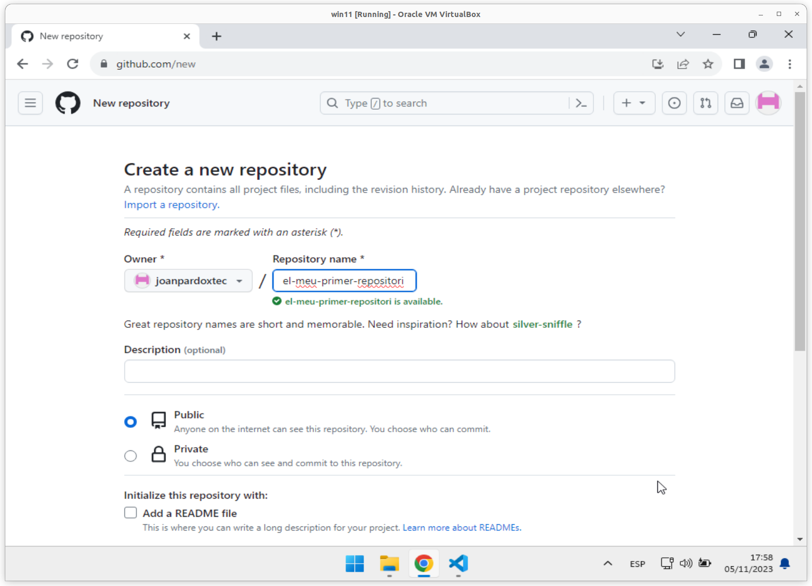

# A01U - Activitat 1 - Primera activitat amb ***```git```***

## ***QUATRE*** pre-requisits:

***Requisit* 1.** Tenir instal·lat l'**```IDE```** **```Visual Studio Code```**. Un **```IDE```** és un **Entorn integrat de desenvolupament** (de les sigles en anglès: ***Integrated Development Environment***).

> ### Per fer la instal·lació del **```Visual Studio Code```** podeu seguir els [Passos per instal·lar l'**IDE** **```Visual Studio Code```**](./manuals/vsc-instalar.md)

***Requisit* 2.** Tenir instal·lat el **sistema de control de versions** **```git```**. Consisteix en una aplicació que **gestiona de canvis en arxius i directoris**.

> ### Per fer la instal·lació del **sistema de control de versions** **```git```** podeu seguir les [Passos per instal·lar el **sistema de control de versions** **```git```**](./manuals/git-instalar-git.md)

Aquí teniu un [Git Tutorial (w3schools.com)](https://www.w3schools.com/git/default.asp?remote=github)

***Requisit* 3.** Tenir un compte de [**```github.com```**](https://github.com/), podeu seguir els passos de [**Getting started with your GitHub account**](https://docs.github.com/en/get-started/onboarding/getting-started-with-your-github-account)


***Requisit* 4.** Tenir creat al vostre ordinador l'**estructura inicial**, cal que seguiu els passos de [Passos per crear **l'estructura inicial**](./manuals/crea-creacio-estructura.md) 

> ### Abans de començar cal fer la [Comprovació de que ho teniu ben instal·lat](./manuals/ctrl-comprovacio-tot-ben-installat.md)

Un cop ja teniu els **dos programes instal·lats**, el **compte creat** [**```github.com```**](https://github.com/) i **l'estructura inicial** creada, ja podeu començar aquesta activitat.

## Objectiu:

Crear un projecte amb el nom **```el-meu-primer-repositori```**, amb:
* un **repositori local** i
* un **repositori remot**,
* que estiguin **vinculats**.

Fent servir **```git```** com a **sistema de control de versions** i l'**IDE** **```Visual Studio Code```**.

## **Pas 1.** Crear un **repositori local** al vostre ordinador.

> ## NOTA: **Bona pràctica** 
> 
>  Com a **bona pràctica**, us recomano, crear sempre una carpeta pel ***repositori local***, amb el mateix nom que el vostre ***repositori remot***.

Nom de la carpeta per crear el vostre **repositori local**: **```el-meu-primer-repositori```**.


Dins de la carpeta **```c:\smx2\repos```**, crearem la carpeta **```el-meu-primer-repositori```**.


Ara obrirem la carpeta **```c:\smx2\repos\el-meu-primer-repositori```** des de el **```Visual Studio Code```**.


Per fer-ho, seleccionada la carpeta **```c:\smx2\repos\el-meu-primer-repositori```**, pitjarem el botó dret del ratolí, i seleccionarem l'opció **```Show more options```**, perquè ens mostri més opcions del menú contextual.


I a continuació seleccionarem l'opció **```Open with Code```**, per que ens obri el **```Visual Studio Code```** situat ja en aquesta carpeta.

La primera vegada que obrim qualsevol carpeta amb **```Visual Studio Code```**, aquest ens pregunta si ***Confiem en els autors dels fitxers d'aquesta carpeta***, li diem que ***sí***, és a dir, pressionem el botó . 


I ja tenim el **```Visual Studio Code```** obert i situat a la carpeta **```c:\smx2\repos\el-meu-primer-repositori```**.


## **Pas 2.** Crear un **repositori remot** al vostre compte de [**```github.com```**](https://github.com/).

Des de el vostre compte de [**```github.com```**](https://github.com/),
desplegant el símbol **```+```**  i escollirem l'opció **New repository**, per crear un nou repositori.


A la finestra **Create a new repository**, en el camp **```Repository name```** escriurem el nom del repositori que volem crear, en el nostre cas, i seguint les bones pràctiques comentades, serà el nom del projecte **```el-meu-primer-repositori```**.



A continuació marquem l'opció **```Private```**. 
> ## NO cal marcar l'opció **```Add a README.md file```**.


I per últim pressionem el botó **```Create repository```**, per crear el nou repositori.

Un cop creat el nou repositori ens apareix el següent:


Si ens desplacem una mica cap avall, veurem un seguit de comandes a la secció amb el titol **```... or create a new repository on the command line```**


Aquestes son les comandes, i cal copiar-les totes per poder-les fer servir a continuació.

```
echo "# el-meu-primer-repositori" >> README.md
git init
git add README.md
git commit -m "first commit"
git branch -M main
git remote add origin https://github.com/<usuariGithub>/el-meu-primer-repositori.git
git push -u origin main
```

> Si no us funciona el botó de copiar, sempre podeu seleccionar les comandes i amb el botó dret del ratolí copiar-les al porta-papers del sistema operatiu.
>
> 

## **Pas 3.** Vincular el vostre **repositori local** amb el vostre **repositori remot** creat al compte de [**```github.com```**](https://github.com/).

Un cop que hem copiat totes aquestes comandes, passarem al **```Visual Studio Code```**.

I com ja s'ha vist anteriorment, obrirem una **finestra de terminal**.


Un cop oberta la **finestra de terminal** podeu enganxar totes les comandes, col·loqueu-vos a sobre de la **finestra de terminal** i  pressionant el botó dret del ratolí se us enganxaran les comandes que heu copiat anteriorment. 


Si a continuació pressioneu la tecla <kbd>Intro</kbd>

La primera vegada us apareixerà aquesta finestra, per validar l'usuari i la contrasenya.


