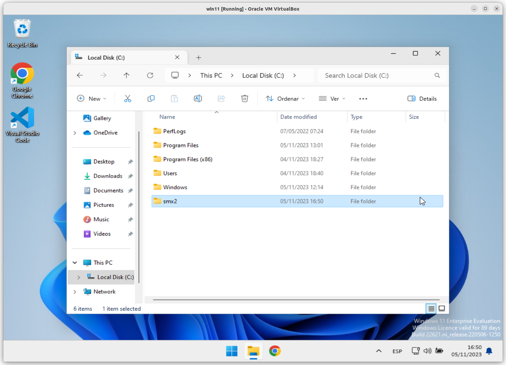

# Passos per crear **l'estructura inicial**

## Creació de l'estructura al vostre ordinador.

> ## NOTA: **Bona pràctica** 
> 
> Com a **bona pràctica**, us recomano:
> 
> **1.** ***MAI*** fer servir ***NOMS MASSA LLARGS*** per crear carpetes,
> 
> **2.** ***MAI*** fer servir ***ESPAIS ALS NOMS DE LES CARPETES***.
>
> **3.** Crear una carpeta a l'arrel de la vostra unitat i allà col·locar tots els **repositoris locals** que aneu creant.

Jo seguiré l'exemple, creant una carpeta amb el nom **```smx2```**, dins de la què crearé una altra carpeta amb el nom **```repos```**, i allà serà a on crei tots els repositoris. 

Creació de la carpeta amb el nom **```smx2```** a l'arrel:




Creació de la carpeta amb el nom **```repos```** dins de la **```smx2```** creada a l'arrel.


