# Passos per instal·lar el **sistema de control de versions** **```git```**

## *Pas 1*: Descàrrega del programa a instal·lar.

Cal que visiteu la següent pàgina web [https://git-scm.com/downloads](https://git-scm.com/downloads)

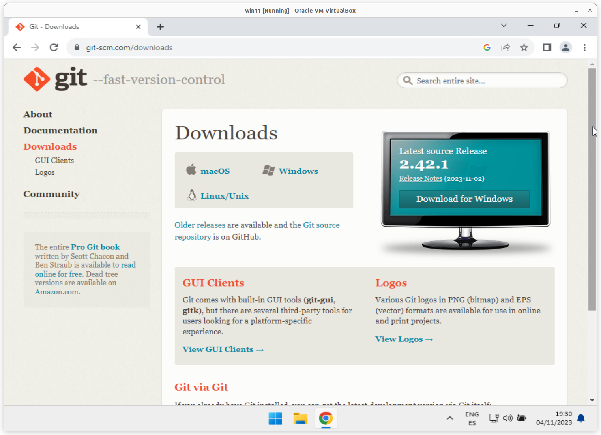

i pressioneu el següent botó: 

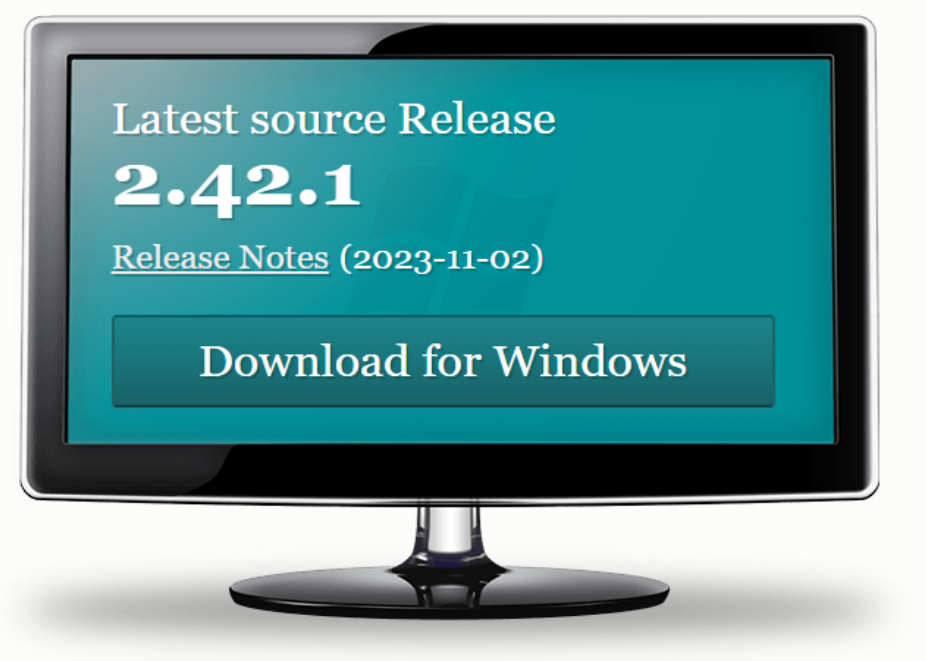

I se'ns obrirà la següent pàgina:

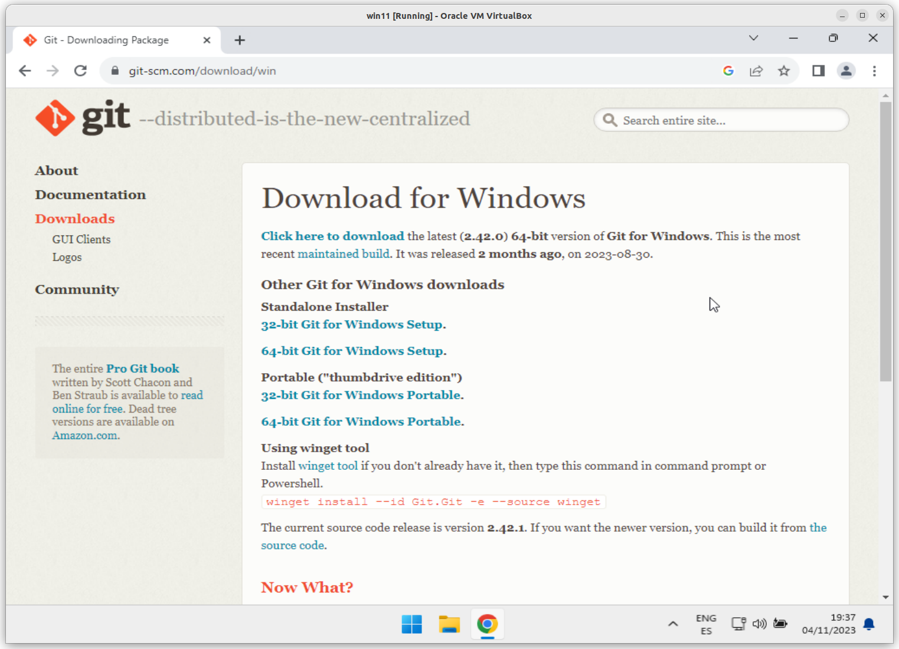

D'on cal que seguim l'enllaç **```64-bit Git for Windows Setup```**, per descarregar el fitxer [Git-2.42.0.2-64-bit.exe](https://github.com/git-for-windows/git/releases/download/v2.42.0.windows.2/Git-2.42.0.2-64-bit.exe).

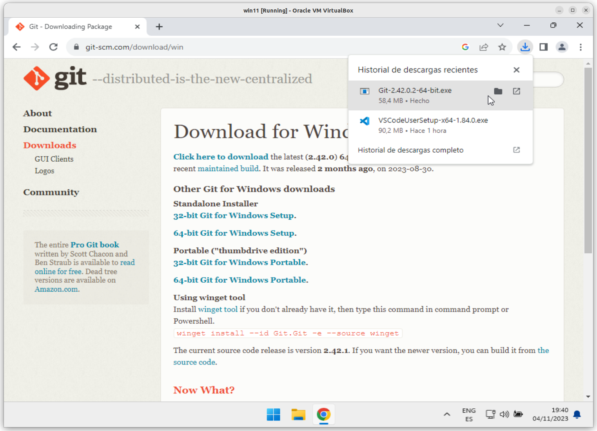

Si voleu el poder obtenir aquí [Git-2.42.0.2-64-bit.exe](./files/Git-2.42.0.2-64-bit.exe)

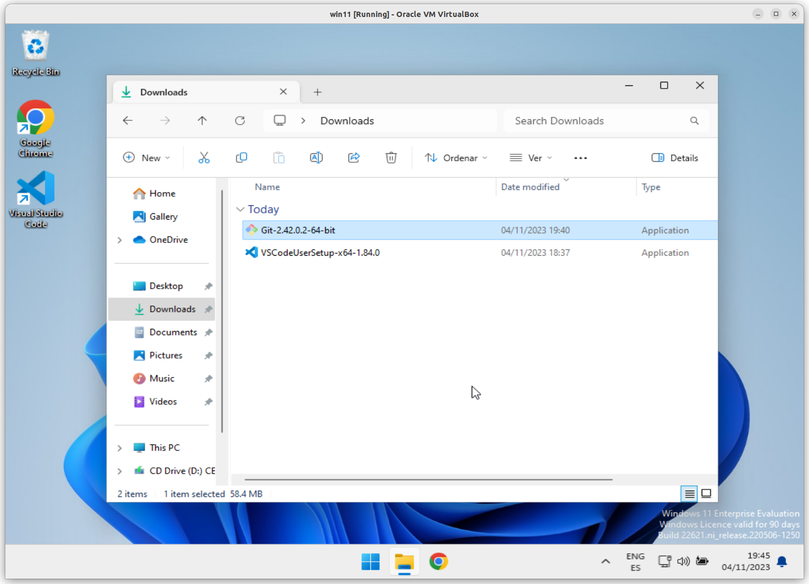

Un cop ja tingueu el fitxer [Git-2.42.0.2-64-bit.exe](./files/Git-2.42.0.2-64-bit.exe) descarregat, el podem executar.

## *Pas 2*: Instal·lació del programa.

En executar el fitxer descarregat, ens apareix una finestra de **UAC** (***User Account Control***), demanant-nos una confirmació perque l'aplicació **```Git for Windows```** faci canvis en el nostre ordinador. Pressionem el botó <kbd>Yes</kbd>.

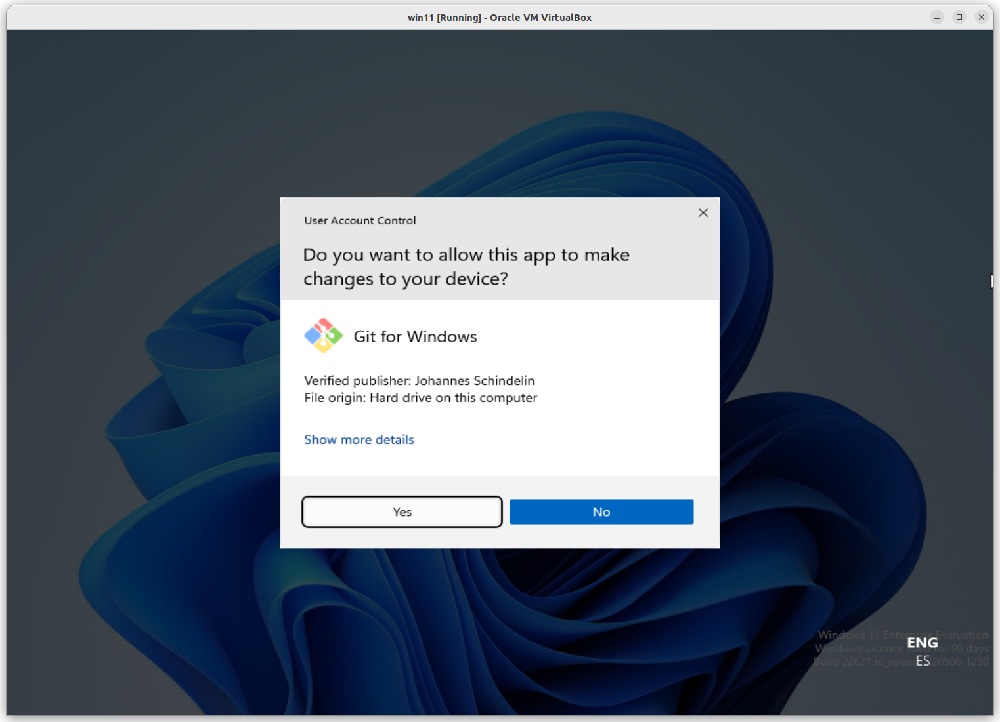

Ens apareix la finestra **Information** informant-nos del termes legals.

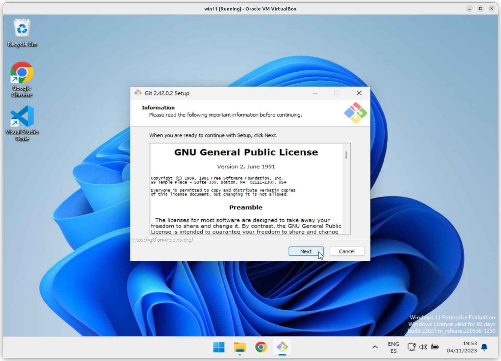

Pressionem el botó <kbd>Next</kbd> per acceptar-los.

Això, ens porta a la finestra **Select Destination Location**, on ens mostra la ruta a on s'instal·larà el programa.

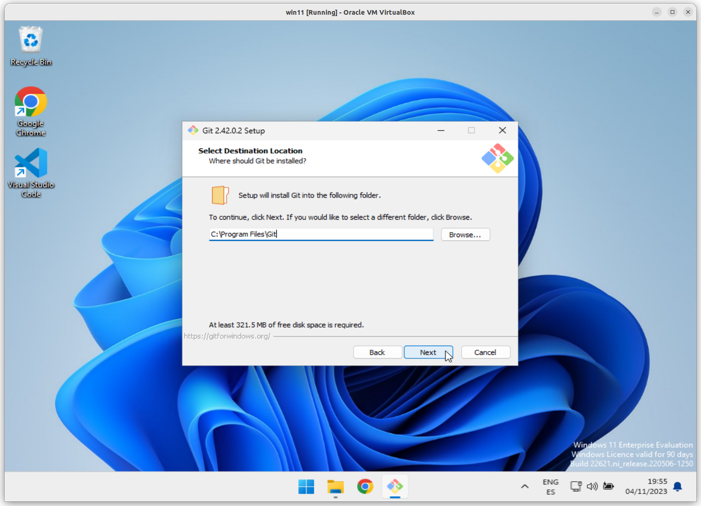

Nosaltres no ho farem, pero es podria modificar aquesta ruta.

Per seguir, es pressiona el botó <kbd>Next</kbd>. 

Que ens portarà a la finestra **Select Components**, 

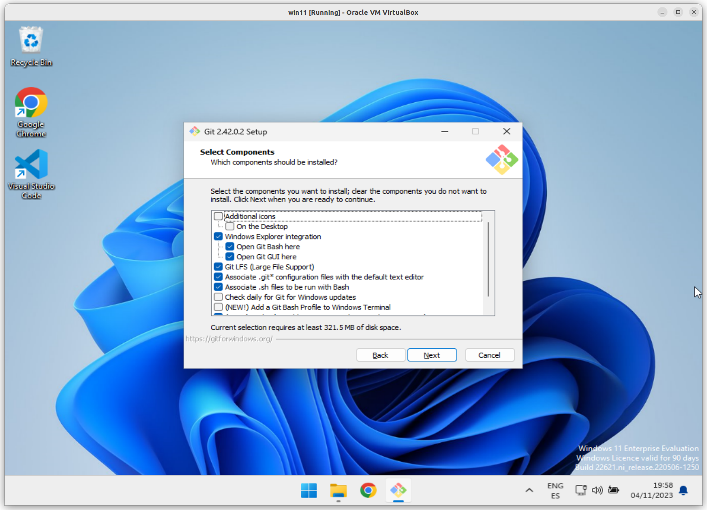

I deixem les opcions marcades per defecte, i es pressiona el botó <kbd><u>N</u>ext ></kbd>.

A la finestra **Select Start Menu Folder** ens mostra la carpeta del menú **```Start```** a on apareixerà un accés directe al programa.

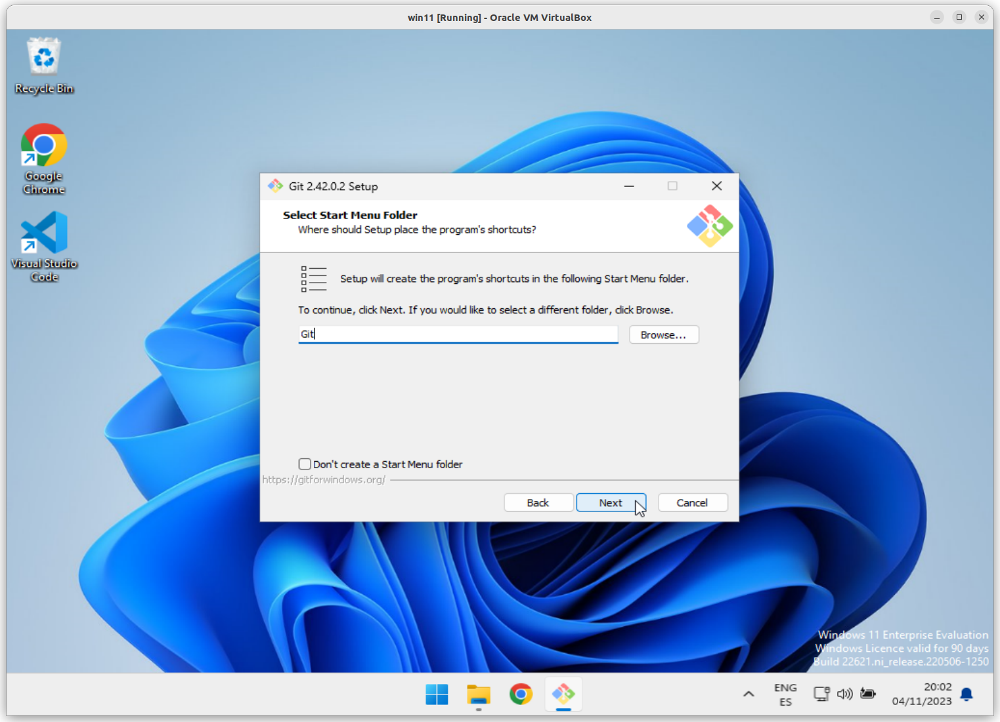

Es podria canviar la carpeta ruta, pero, nosaltres no ho farem.

Es pressiona el botó <kbd>Next</kbd>, per seguir amb la instal·lació.

A continuació ens apareix la finestra **Chossing the default editor used by Git** demanant-nos que escollim quin es l'editor que volem fer servir per defecte amb **```git```**.

Com que ja el tenim instal·lat, escollim la opció **```Use Visual Studio Code as Git's default editor```**, i pressionem el botó <kbd>Next</kbd>, per seguir. 

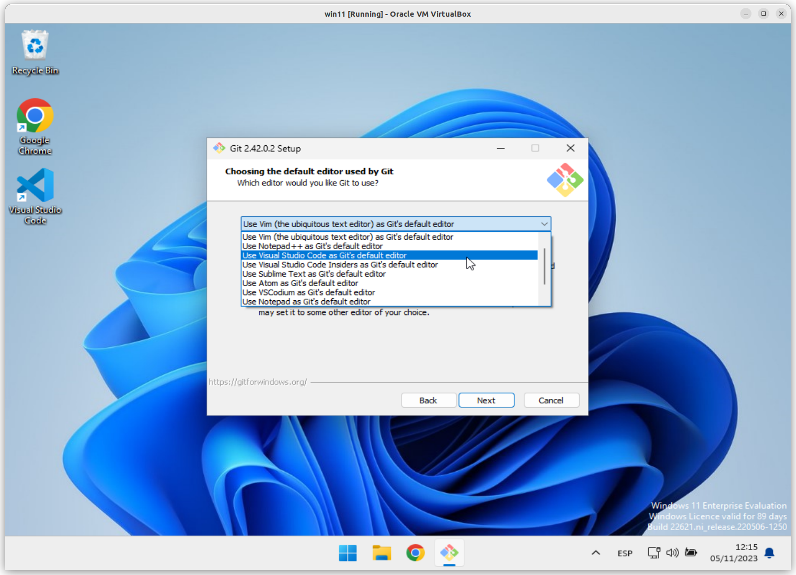

> Si no tenim instal·lat el **```Visual Studio Cod```**, es pot seguir els passos al següent repositori [**Passos per instal·lar ```Visual Studio Code```**](instalar-vsc.md)


Finestra **Adjusting the name of the initial branch in new repositories**, escollim l'opció **Override the the default branch name for new repositories**, ens assegurem que el nom que apareix és **```main```** i pressionem el botó <kbd>Next</kbd>, per seguir.


Finestra **Adjusting your PATH environment**, escollim l'opció **Use Git from Bash only** i pressionem el botó <kbd>Next</kbd>, per seguir.


Finestra **Chossing the SSH executable**, escollim l'opció **Use bundled OpenSSH** i pressionem el botó <kbd>Next</kbd>, per seguir.


Finestra **Chossing HTTPS transport backend**, escollim l'opció **Use the OpenSSL library** i pressionem el botó <kbd>Next</kbd>, per seguir.


Finestra **Chossing the line ending conversion**, escollim l'opció **Checkout Windows-style, commit Unix-style line endings** i pressionem el botó <kbd>Next</kbd>, per seguir.


Finestra **Configuring the terminal emulator to use with Git Bash**, escollim l'opció **Use MinTTY (the default terminal of MSYS2)** i pressionem el botó <kbd>Next</kbd>, per seguir.


Finestra **Choose the default dehavior of 'git pull'**, escollim l'opció **Default (fast-forward or merge)** i pressionem el botó <kbd>Next</kbd>, per seguir.


Finestra **Choose a credential helper**, escollim l'opció **Git Credential Manager** i pressionem el botó <kbd>Next</kbd>, per seguir.

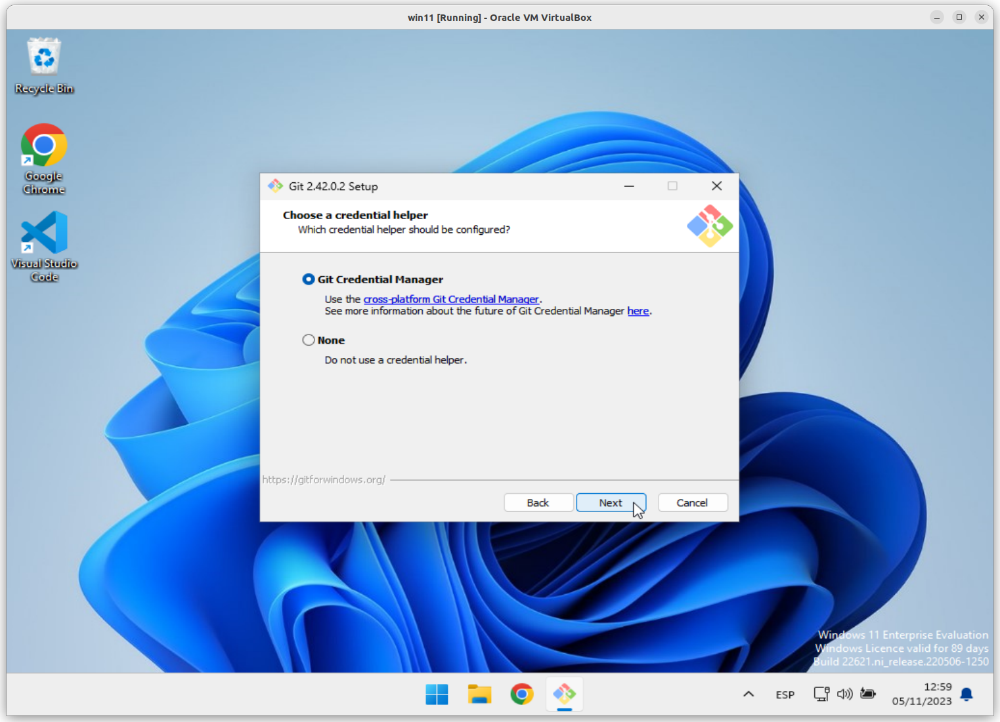

Finestra **Configuring extra options**, marquem només  l'opció **Enable file system caching** i pressionem el botó <kbd>Next</kbd>, per seguir.


Finestra **Configuring experimental options**, i **desmarquem** totes les opcions, si es que hi ha alguna marcada, i pressionem el botó <kbd><u>I</u>nstall</kbd>, per finalitzar la instal·lació.

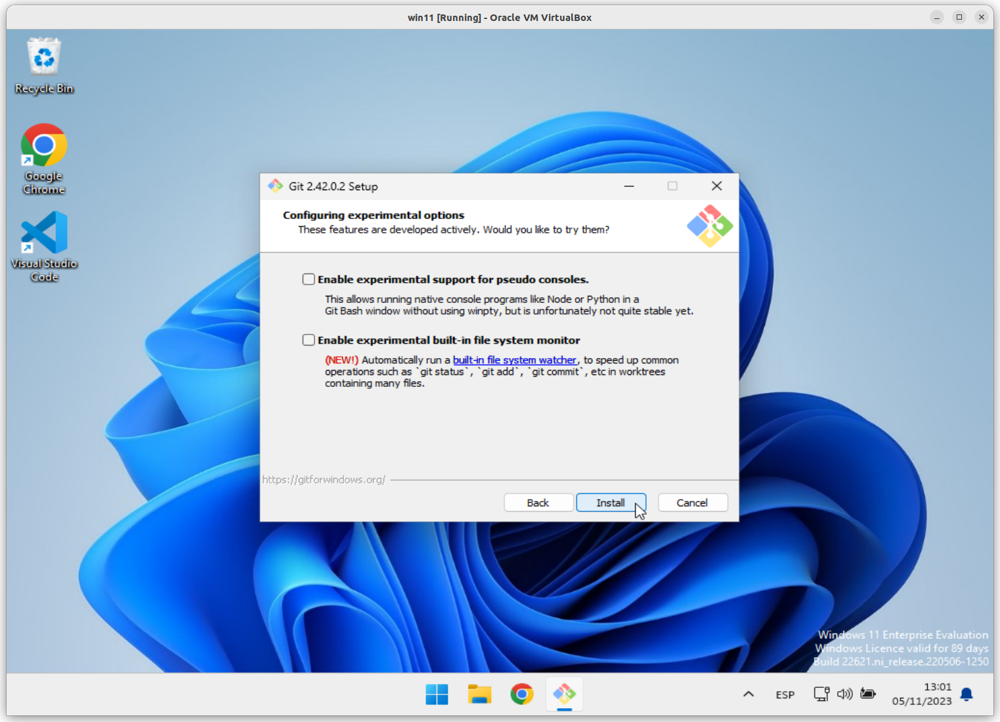

Imatge durant la instal·lació.

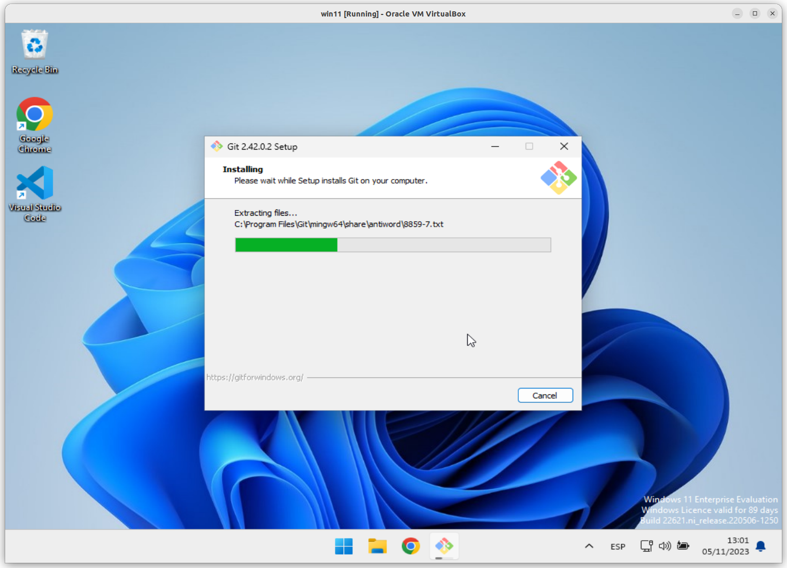

Finestra **Completing the Git Setup Wizard**, i només **marquem** l'opció **Launch Git Bash**, desmarcan l'altra opció, si es que està marcada, i pressionem el botó <kbd><u>F</u>inish</kbd>, per executar per primera vegada l'aplicació.

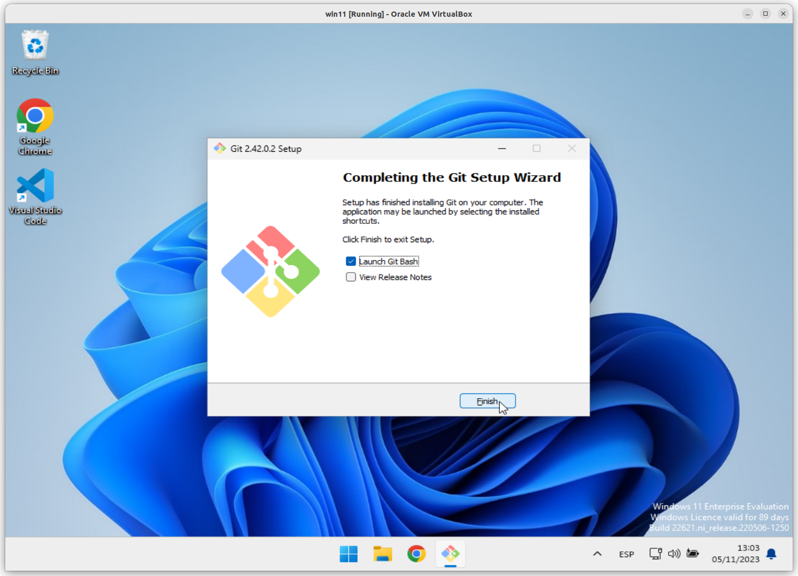

Ja està instal·lat, ara només queda, pressionar el botó <kbd><u>F</u>inish</kbd>, per arrencar el programa.

Aquest és l'aspecte un cop instal·lat i executat per primera vegada.

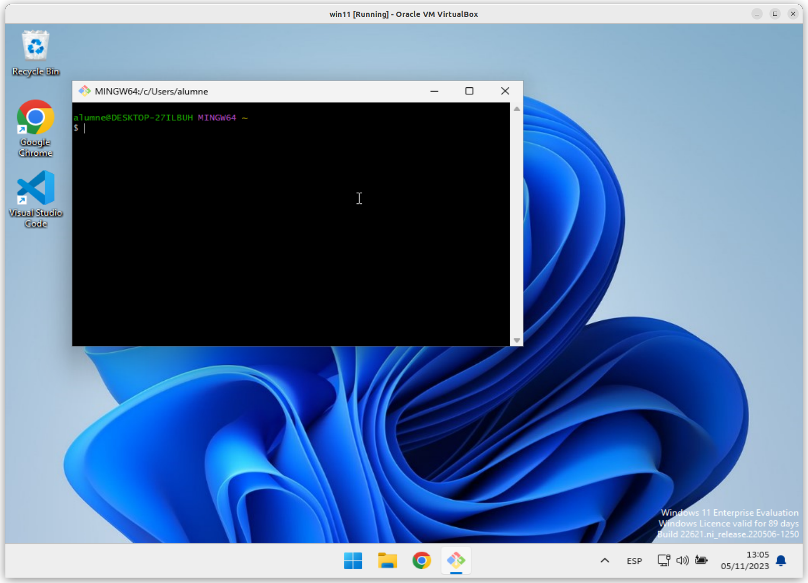

Ja el tenim instal·lat i ja el tanquem, ho podem fer pressionant <kbd>Alt</kbd> + <kbd>F4</kbd>