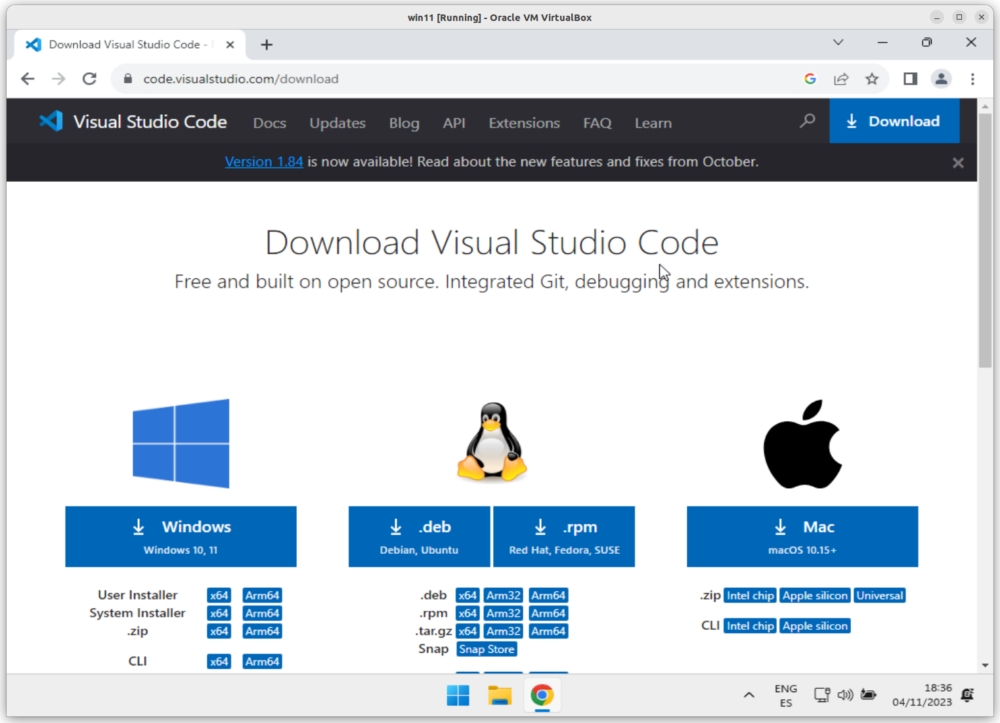
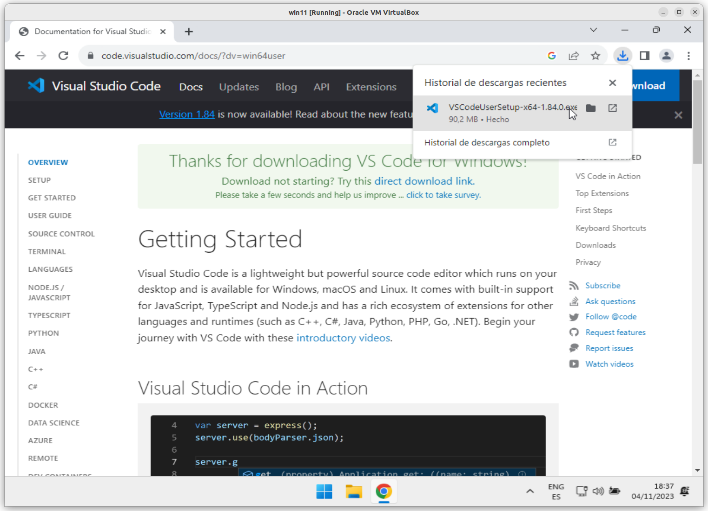
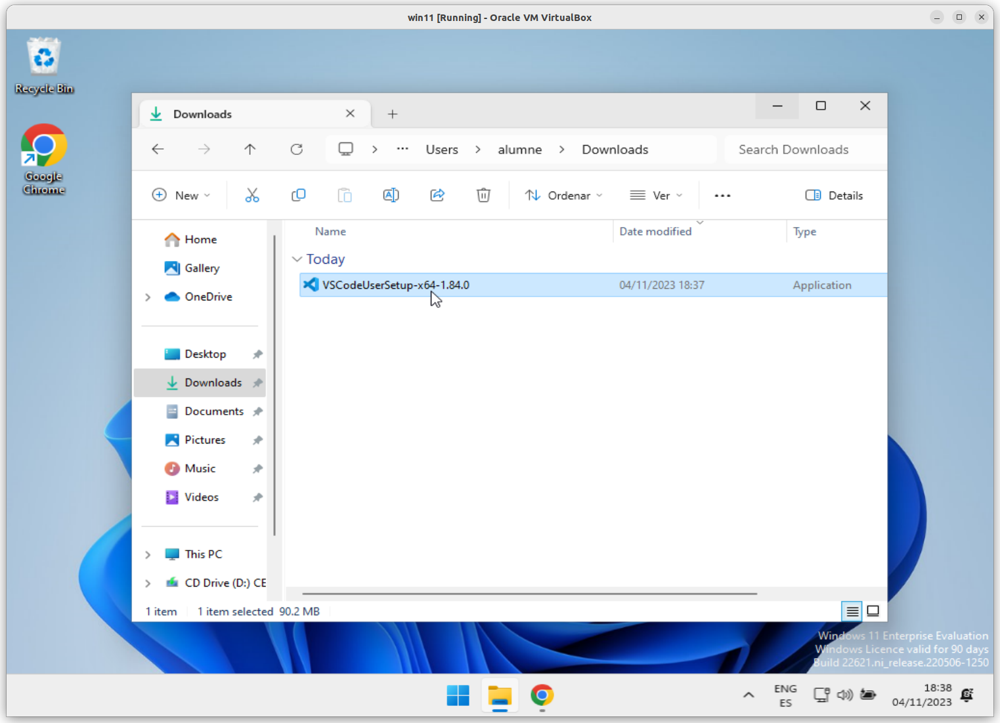
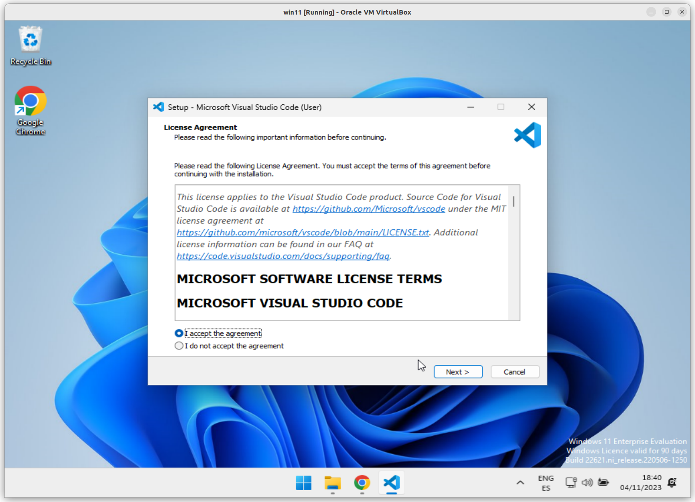
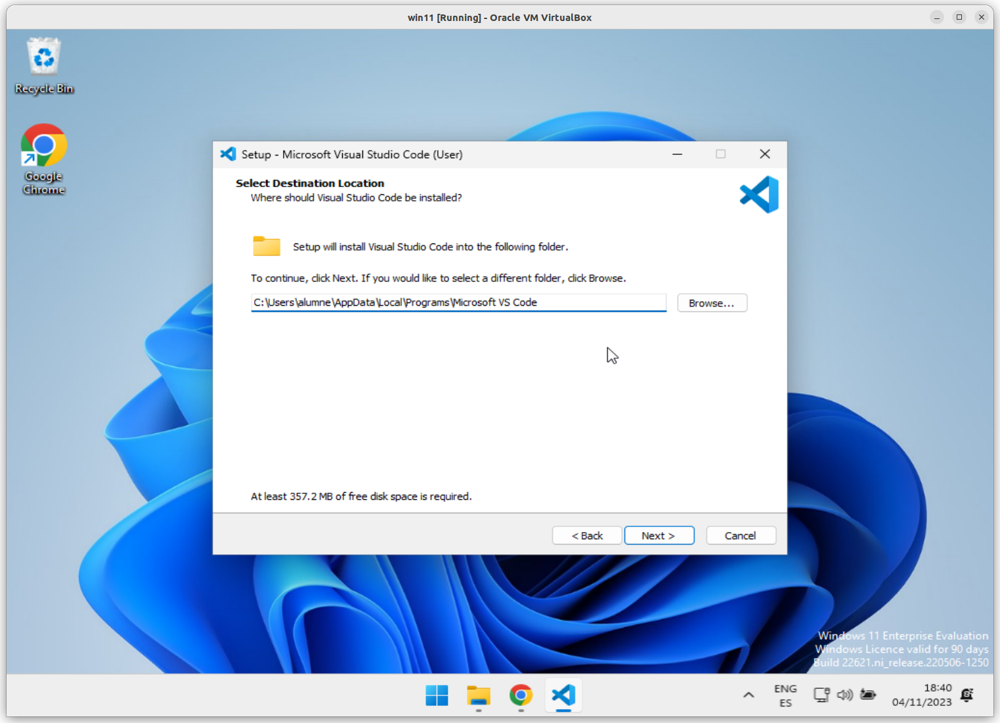
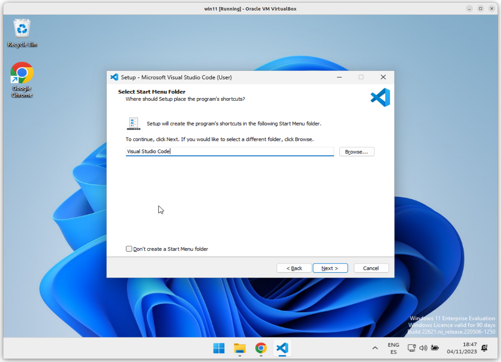
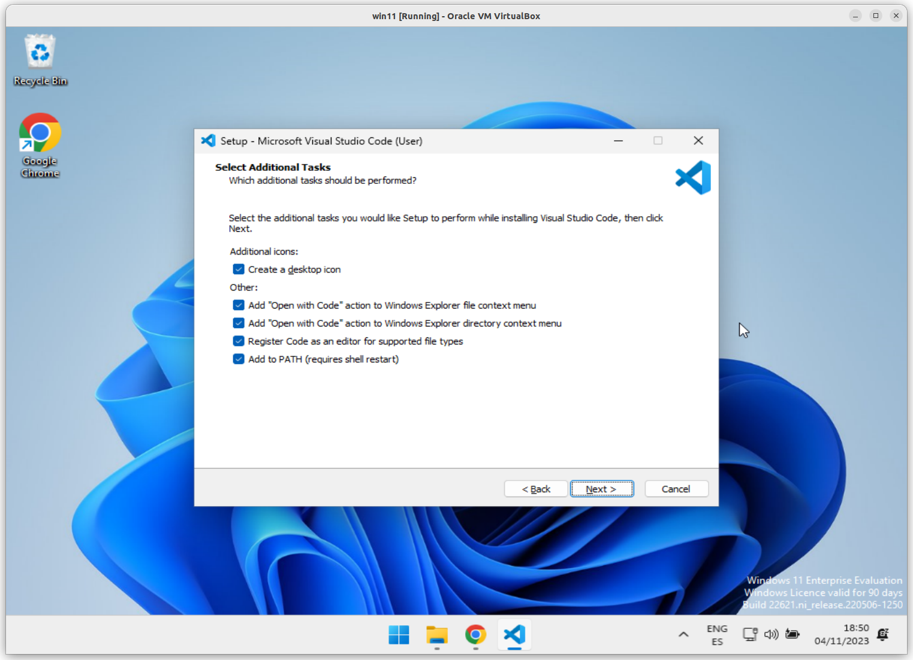
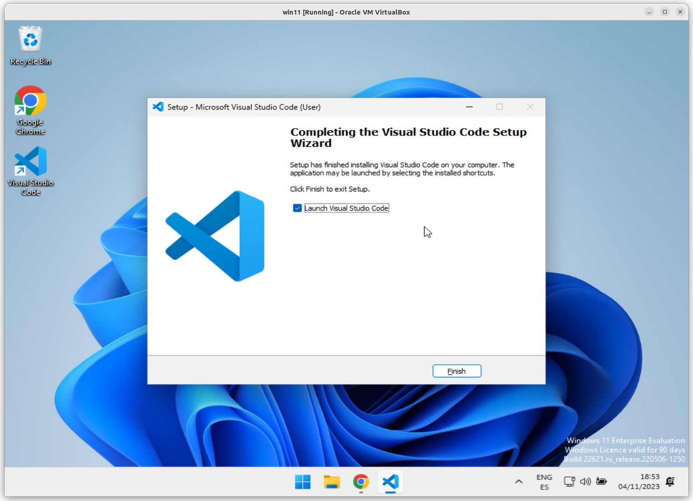
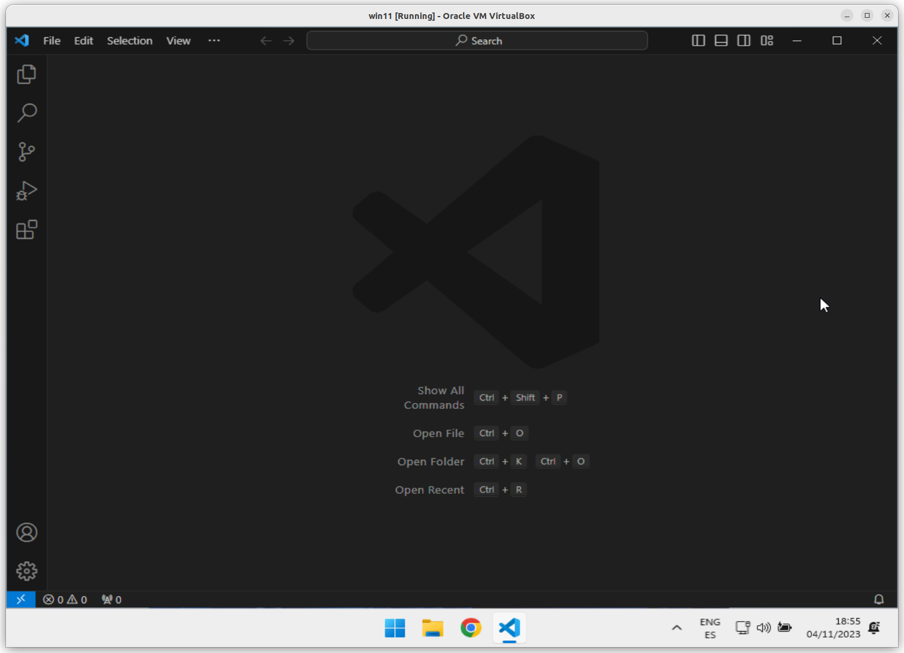

# Passos per instal·lar l'**IDE** ***```Visual Studio Code```***

[Getting started with Visual Studio Code](https://code.visualstudio.com/docs/introvideos/basics)

> ## NOTA: 
> ### Si ja teniu l'**IDE** ***```Visual Studio Code```*** instal·lat i <ins>*NO heu seguit els passos correctament*</ins>, us <span style="font-size: 20px; color: red;">**recomano encaridament**</span>, que el desinstal·leu i el torneu a instal·lar, però seguint els passos descrits en aquest manual.
> ## 

## *Pas 1*: Descàrrega del programa a instal·lar.

Cal que visiteu la següent pàgina web [https://code.visualstudio.com/download](https://code.visualstudio.com/download)



i pressioneu el següent botó:


Per descarregar el fitxer [VSCodeUserSetup-x64-1.84.0.exe](https://code.visualstudio.com/sha/download?build=stable&os=win32-x64-user).



Si voleu el poder obtenir aquí [VSCodeUserSetup-x64-1.84.0.exe](./files/VSCodeUserSetup-x64-1.84.0.exe)



Un cop ja tingueu el fitxer [VSCodeUserSetup-x64-1.84.0.exe](https://code.visualstudio.com/sha/download?build=stable&os=win32-x64-user) descarregat, el podem executar.

## *Pas 2*: Instal·lació del programa.

A la primera finestra **License Agreement**.



Es marca l'opció **```I accept the agreement```** i es pressiona el botó <kbd><u>N</u>ext ></kbd>.

Això, ens porta a la finestra **Select Destination Location**, on ens mostra la ruta a on s'instal·larà el programa.



Nosaltres no ho farem, pero es podria modificar aquesta ruta.

Per seguir, es pressiona el botó <kbd><u>N</u>ext ></kbd>. 

Que ens portarà a la finestra **Select Start Menu Folder**, on ens mostra la carpeta al menú **```Start```** a on apareixerà un accés directe al programa.

Es podria canviar la carpeta ruta, pero, nosaltres no ho farem.



Tot seguit, es pressiona el botó <kbd><u>N</u>ext ></kbd>. 

I la següent finestra és **Select Additional Task Menu Folder**.

Per defecte apareixen aquestes opcions seleccionades:


I nosaltres seleccionarem **```TOTES```** les opcions.



Un cop seleccionades **```TOTES```** les opcions, per continuar, cal pressionar el botó <kbd><u>N</u>ext ></kbd>.

Ara veiem la finestra **Ready to Install**, on ens permet veure quines són les opcions escollides per fer la instal·lació.


Un cop validem que les opcions escollides són les correctes, ja podem pressionar el botó <kbd><u>I</u>nstall</kbd>



Ja està instal·lat, ara només queda pressionar el botó <kbd><u>F</u>inish</kbd>, per arrencar el programa.

Aquest és l'aspecte un cop instal·lat i executat per primera vegada.



Ja el tenim instal·lat i ja el tanquem, ho podem fer pressionant <kbd>Alt</kbd> + <kbd>F4</kbd>